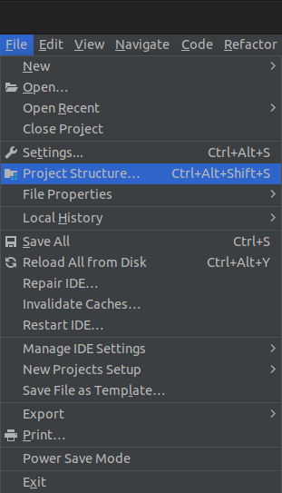
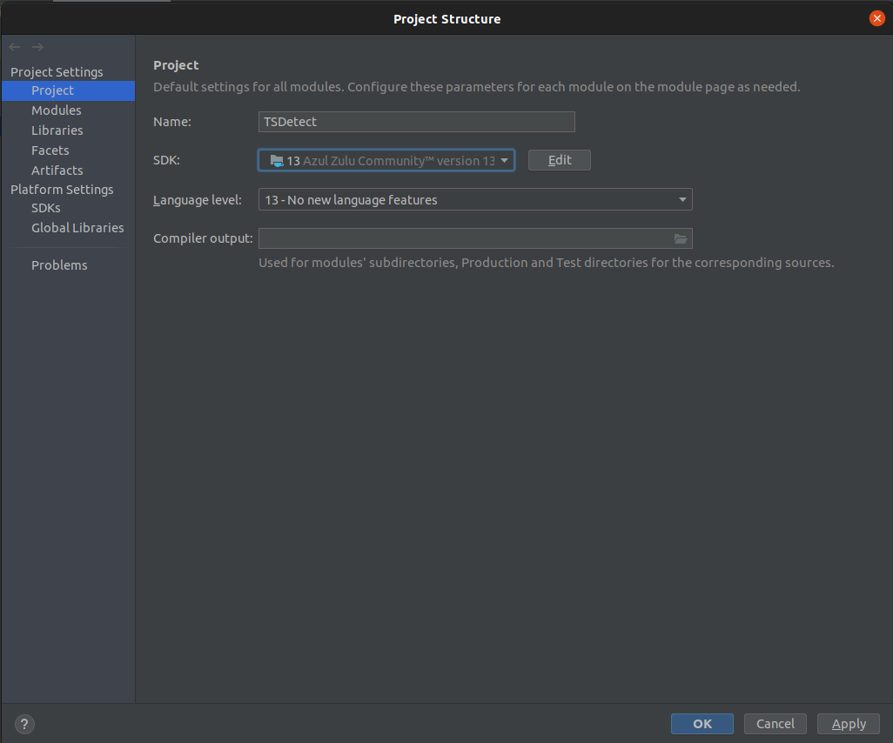
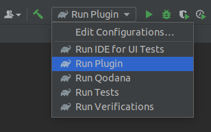

# TSDetect

[//]: # ()
[//]: # (## Template ToDo list)

[//]: # (- [x] Create a new [IntelliJ Platform Plugin Template][template] project.)

[//]: # (- [ ] Get familiar with the [template documentation][template].)

[//]: # (- [ ] Verify the [pluginGroup]&#40;/gradle.properties&#41;, [plugin ID]&#40;/src/main/resources/META-INF/plugin.xml&#41; and [sources package]&#40;/src/main/kotlin&#41;.)

[//]: # (- [ ] Review the [Legal Agreements]&#40;https://plugins.jetbrains.com/docs/marketplace/legal-agreements.html&#41;.)

[//]: # (- [ ] [Publish a plugin manually]&#40;https://plugins.jetbrains.com/docs/intellij/publishing-plugin.html?from=IJPluginTemplate&#41; for the first time.)

[//]: # (- [ ] Set the Plugin ID in the above README badges.)

[//]: # (- [ ] Set the [Deployment Token]&#40;https://plugins.jetbrains.com/docs/marketplace/plugin-upload.html&#41;.)

[//]: # (- [ ] Click the <kbd>Watch</kbd> button on the top of the [IntelliJ Platform Plugin Template][template] to be notified about releases containing new features and fixes.)

<!-- Plugin description -->

[//]: # (This Fancy IntelliJ Platform Plugin is going to be your implementation of the brilliant ideas that you have.)
TSDetect is your all in one tool for deteing code smells within your tests. Based on the research by [https://testsmells.org/](https://testsmells.org/), This plugin analyzes unit tests in order to find potential design flaws.

[//]: # (This specific section is a source for the [plugin.xml]&#40;/src/main/resources/META-INF/plugin.xml&#41; file which will be extracted by the [Gradle]&#40;/build.gradle.kts&#41; during the build process.)

[//]: # (To keep everything working, do not remove `<!-- ... -->` sections. )
<!-- Plugin description end -->

## Installation

- Using IDE built-in plugin system:
  
  <kbd>Settings/Preferences</kbd> > <kbd>Plugins</kbd> > <kbd>Marketplace</kbd> > <kbd>Search for "TSDetect"</kbd> >
  <kbd>Install Plugin</kbd>
  
- Manually:

  Download the [latest release](https://github.com/TestSmells/TSDetect/releases/latest) and install it manually using
  <kbd>Settings/Preferences</kbd> > <kbd>Plugins</kbd> > <kbd>⚙️</kbd> > <kbd>Install plugin from disk...</kbd>

## Contributing
For contributing test smells to the project see the [Contributing Page](Documentation/Contributing.md)

## Setup

### Clone repository
We recommend [cloning through IntelliJ](https://blog.jetbrains.com/idea/2020/10/clone-a-project-from-github/). This will ensure all dependencies are set up correctly. Be sure to give gradle time to finish setting up.  

### Set JDK Version 
Ensure that project **JDK** and **Language Level** are set to 13
This can be found as shown below
<kbd>File</kbd> > <kbd>Project Structure</kbd> > <kbd>Project</kbd>
    
| Open Project Structure                                           | Select JDK13 and Language Level 13                                    |
|------------------------------------------------------------------|-----------------------------------------------------------------------|
|  |  |

### Running Plugin
Select the Run Plugin option from the drop down. 

 
### Running Unit Tests
- There is a known issue where gradle will not always update the version of java used to run unit tests,
can be fixed manually in 
- This can be remedied by manually going into following setting sand updating to use java 13
  
<kbd>Project Settings</kbd> > <kbd>Build</kbd> > <kbd>Execution</kbd> > <kbd>Deployment</kbd> > <kbd>Build Tools</kbd> > <kbd>Gradle</kbd>

---

For more info, please go to https://testsmells.org/

Plugin based on the [IntelliJ Platform Plugin Template][template].

[template]: https://github.com/JetBrains/intellij-platform-plugin-template

