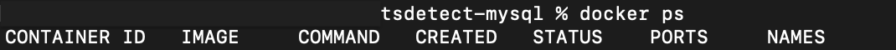
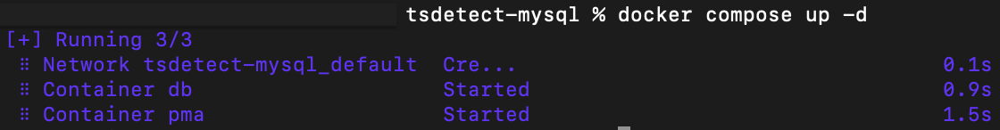
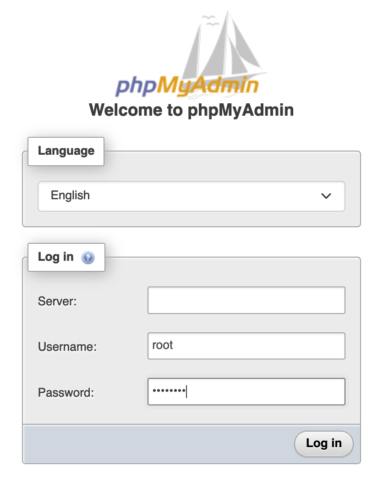
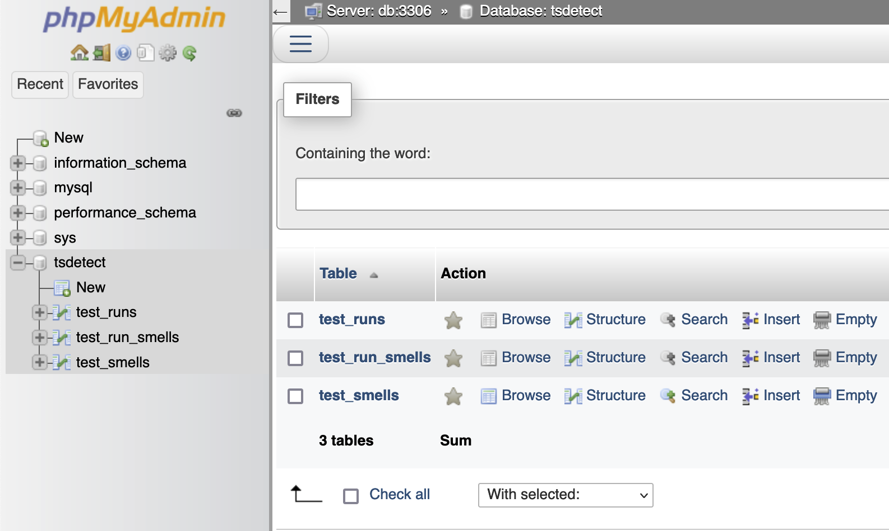

# Setup the TSDetect Centralized Relational Database

The TSDetect centralized relational database is hosted in a Docker container and is accessible with phpMyAdmin.

The docker-compose file builds the MySQL image and populates the tsdetect database with the initial tables and user permissions via an SQL query: init.sql. The phpMyAdmin image is built as well and linked to the database instance. Both images are then run in separate containers.

The init.sql file creates the tables as defined in the database schema TDD and creates users for the plugin and dashboard with appropriate permissions. The test_smells table is populated with all currently defined smell types and the test_runs and test_smell_runs table are populated with random data for testing. 

**Remove or comment out the last line of the SQL file to prevent random data insertion.**

## Install Docker

### Docker Desktop (Recommended) 

> [Windows](https://docs.docker.com/desktop/install/windows-install/) | [Mac](https://docs.docker.com/desktop/install/mac-install/) | [Linux](https://docs.docker.com/desktop/install/linux-install/)   Open Docker Desktop after installation.

### Docker from binaries

> Follow [these instructions](https://docs.docker.com/engine/install/binaries/) to install Docker using binaries. This is not recommended by Docker for production. This method should only be used for a Linux distribution not supported by Docker Desktop.

## Create and run containers

There are two containers being built and run:
 - db = the mySQL database instance hosted on localhost:3306 for connections within Docker and localhost:3008 for external connections
 - pma = phpMyAdmin linked to the database and hosted on localhost:8081

### Windows

- Double click the name-appropriate bat file to start, stop, and kill the db and pma containers.

### MacOS and Linux

Launch a terminal window and navigate to this directory on your machine: tsdetect-mysql

1.  Ensure Docker is running!

    `docker ps` lists all Docker containers.

---

2.  Run docker compose to create and run the containers 

    `docker compose up -d`

- Run `docker stop db pma` to stop the database and phpMyadmin containers.
- Run `docker compose down` to kill and remove the containers.

---

3. Navigate to http://localhost:8081 in a browser and login with username=root and password=password

---

4. Verify the tsdetect database has been created and populated.

